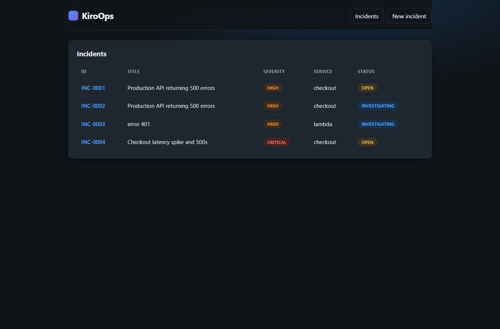
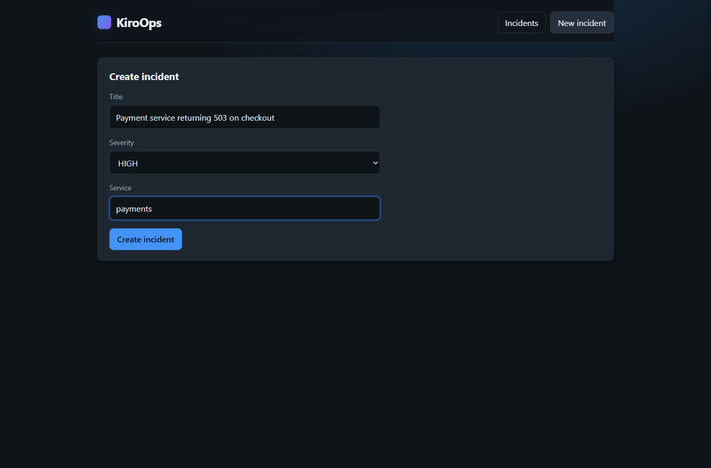
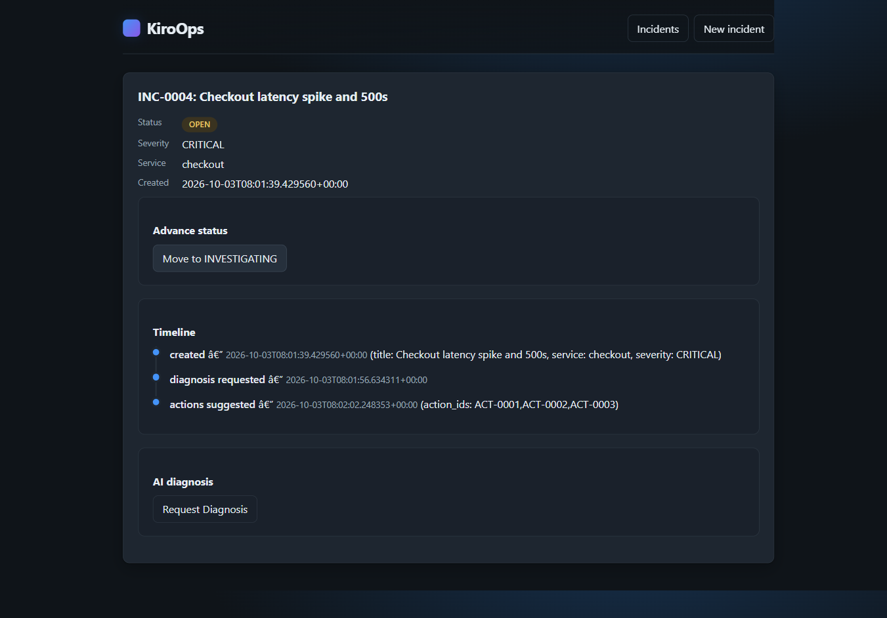
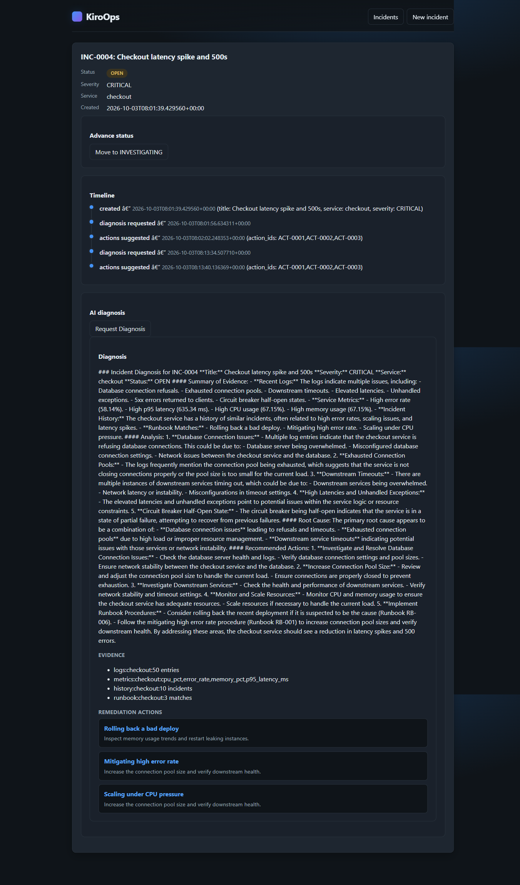

# KiroOps

AI-powered incident investigation platform for developers, built for the Kiro
University Challenge. A developer submits an incident (title, service,
severity); KiroOps tracks it through a constrained lifecycle, gathers evidence
through a custom MCP server, produces an AI diagnosis with recommended
remediation actions, and maintains an append-only incident timeline.

## Live Demo (deployed on AWS)

- Frontend (CloudFront): https://d2k4ginzxvtoqs.cloudfront.net
- API (API Gateway): https://9gjx9zin9g.execute-api.us-east-1.amazonaws.com
- API health check: https://9gjx9zin9g.execute-api.us-east-1.amazonaws.com/health

Serverless stack in `us-east-1`: API Gateway -> AWS Lambda (FastAPI via Mangum,
ARM64/Graviton) -> DynamoDB (single-table), with the React SPA on S3 served
through CloudFront. Amazon Bedrock Nova powers AI diagnosis (enable Nova model
access in the Bedrock console for live diagnosis; otherwise the diagnosis
endpoint returns 503 by design). Infrastructure is defined as code in `infra/`
(AWS CDK, Python).

## Screenshots

Incident dashboard - all incidents from DynamoDB with color-coded severity and status badges:



Create an incident - validated form (unique INC-#### id, status OPEN on create):



Incident detail - current status, append-only timeline, and valid-next-state controls:



AI diagnosis - evidence-based diagnosis from Amazon Bedrock Nova via the MCP-fed agent, with remediation actions:



See [docs/walkthrough.md](docs/walkthrough.md) for the full step-by-step tour (including the GitHub repo and `.kiro` folder).
## Kiro University Lesson Mapping

| Lesson | Feature | Evidence (path) |
|--------|---------|-----------------|
| 1. Spec-driven development | requirements -> design -> tasks | `.kiro/specs/incident-management/` |
| 2. Steering | persistent project guidance | `.kiro/steering/` |
| 3. Hooks | lint/test automation | `.kiro/hooks/` |
| 4. Property-based testing | Hypothesis property tests (6 properties) | `backend/tests/*_property.py` |
| 5. Powers | Incident Analysis Power | `powers/incident-analysis/` |
| 6. MCP | custom MCP server (4 tools) | `mcp/incident-mcp/` + `.kiro/settings/mcp.json` |
| 7. Custom Agent | Incident Commander agent | `.kiro/agents/incident-agent.json` |

A detailed index, including which test file backs each of the six correctness
properties, is in `docs/lesson-mapping.md`.

## Documentation

- [Article](docs/article.md) - how KiroOps was built, the tech stack, pricing, problems faced, and lessons learned.
- [Walkthrough](docs/walkthrough.md) - a visual, step-by-step tour of the live app with screenshots, each mapped to a lesson.
- [Lesson mapping](docs/lesson-mapping.md) - detailed index of where each lesson lives, including which test backs each correctness property.
- [Demo script](docs/demo-script.md) - a timed 3-minute walkthrough for the submission video.
- [Architecture diagram](docs/architecture.drawio) - editable draw.io / diagrams.net diagram of the full system.
## Architecture


An editable diagram is in [docs/architecture.drawio](docs/architecture.drawio) (open with draw.io / diagrams.net or the VS Code Draw.io extension).


```
Frontend (React/TypeScript)          [optional/later]
    -> Backend API (FastAPI)
        -> Service layer (business rules)
            -> Repository layer (SQLite)
Diagnosis Agent
    -> MCP Server tools (logs, metrics, history, runbook)
    -> LLM Provider (Bedrock/Anthropic)   [injected; stubbed in tests]
```

Deterministic logic (ID generation, status state machine, timeline appends,
agent orchestration) is kept separate from the one non-deterministic boundary
(the LLM call), so the core is fully unit- and property-testable without a live
model. See `.kiro/steering/architecture.md`.

## Repository Layout

```
.kiro/
  specs/incident-management/   Lesson 1: requirements, design, tasks
  steering/                    Lesson 2: product, architecture, coding-standards, testing
  hooks/                       Lesson 3: lint/test hooks (+ Kironomics tracking)
  agents/                      Lesson 7: incident-agent.json
  settings/mcp.json            Lesson 6: MCP server registration
backend/                       Python (FastAPI) service, MCP tools, diagnosis agent, tests
mcp/incident-mcp/              Lesson 6: standalone connectable MCP server
powers/incident-analysis/      Lesson 5: Incident Analysis Power
docs/                          lesson-mapping.md and other docs
```

## Backend Setup

```
cd backend
py -m pip install -e ".[dev]"    # fastapi, uvicorn, pydantic, pytest, hypothesis, httpx
py -m pytest -q                  # run all tests (unit + property-based)
py -m uvicorn api.app:create_app --factory --reload   # run the API
```

Configuration is read from the environment (no secrets in source):
`KIROOPS_DB_PATH`, `KIROOPS_LLM_MODEL_ID`, `KIROOPS_LLM_ENDPOINT`.

## API

| Method | Path | Purpose |
|--------|------|---------|
| POST | `/incidents` | Create an incident (validates title/severity, assigns INC-####, status OPEN) |
| GET | `/incidents` | List incidents |
| GET | `/incidents/{id}` | Get an incident with its timeline |
| PATCH | `/incidents/{id}/status` | Advance status (OPEN -> INVESTIGATING -> RESOLVED) |
| POST | `/incidents/{id}/diagnosis` | Request an AI diagnosis (503 if the LLM is unavailable) |
| GET | `/incidents/{id}/remediation-actions` | List recommended remediation actions |

## Deploying to AWS (Lambda + API Gateway + DynamoDB)

KiroOps runs serverless in the cloud: an HTTP API Gateway fronts a single
Lambda function (the FastAPI app wrapped by Mangum), with **DynamoDB** as the
cloud persistence backend and **Amazon Bedrock Nova** powering live diagnosis.
Local development stays on SQLite, so nothing about the local workflow changes.

The AWS CDK v2 (Python) app lives in [`infra/`](infra/README.md). It is
infrastructure-as-code only and does not deploy automatically. See
[`infra/README.md`](infra/README.md) for prerequisites, install, `cdk synth`,
`cdk deploy`, and the required Bedrock model-access note.

## Status

Backend, MCP server, and diagnosis agent are complete with all six correctness
properties covered by passing property-based tests. The real Bedrock/Anthropic
LLM provider and the React frontend are optional later work; the core runs and
is fully tested with a stubbed model boundary.

## License

This project is licensed under the MIT License - see the [LICENSE](LICENSE) file for details.
