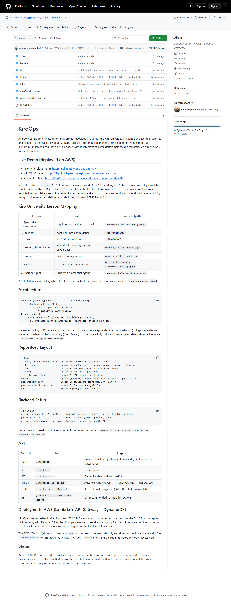
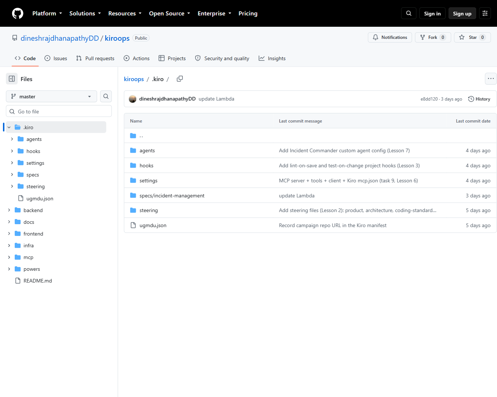

# Building KiroOps: An AI DevOps Incident Assistant with Kiro

## What this project is

KiroOps is an AI-powered incident investigation platform for developers. A
developer files an incident (title, affected service, severity). KiroOps tracks
it through a constrained lifecycle, gathers evidence through a custom MCP
server, asks an AI agent for an evidence-based diagnosis, suggests remediation
actions, and keeps an append-only timeline of everything that happened.

It was built for the Kiro University challenge, and the real goal was to make a
single working project that demonstrates all seven Kiro University lessons as
genuine parts of the development workflow rather than bolted-on afterthoughts:

1. Spec-driven development
2. Steering
3. Hooks
4. Property-based testing
5. Powers
6. MCP (Model Context Protocol)
7. Custom Agents

Live demo:
- Frontend (CloudFront): https://d2k4ginzxvtoqs.cloudfront.net
- API (API Gateway): https://9gjx9zin9g.execute-api.us-east-1.amazonaws.com

Repo: https://github.com/dineshrajdhanapathyDD/kiroops

The KiroOps dashboard, lists incidents from DynamoDB with color-coded severity and status:

## How I built it

I deliberately did not start by asking the agent to "build an incident app." I
started with a specification and let the rest grow from it.

### 1. Spec first (Lesson 1)

The first artifact was a spec in `.kiro/specs/incident-management/`:
requirements (EARS-style: "WHEN ... THE SYSTEM SHALL ..."), a design document,
and a task list. The design named six correctness properties up front - for
example, "incident IDs are unique and monotonic" and "status transitions follow
the state machine." Those properties later became property-based tests. Writing
the spec first meant every later decision had something to check against.

### 2. Steering to guide the agent (Lesson 2)

Before writing code I added steering files in `.kiro/steering/`: a product
overview, an architecture doc (layered: frontend -> API -> service -> repository;
agent -> MCP + LLM), coding standards, and a testing policy. These are applied
on every interaction, so the generated code consistently kept business logic out
of routes, used typed interfaces, and treated the LLM as the only
non-deterministic boundary.

### 3. Building bottom-up, test-driven

I worked through the task list in waves: backend scaffolding, the domain model
and a pure status state machine, the SQLite repository layer, the service layer,
the FastAPI endpoints, the MCP server, and finally the diagnosis agent. Each
layer landed with its tests, and I committed at every meaningful checkpoint so
the history reads like the story of the build.

### 4. Property-based testing (Lesson 4)

The six design properties each got a Hypothesis test running 100+ generated
cases. The two headline invariants - ID format/uniqueness/monotonicity and the
status state machine - are exhaustively exercised. This caught more than example
tests would: it is the difference between "I have unit tests" and "the system's
intent is machine-verified."

### 5. The MCP server (Lesson 6)

A custom MCP server (`mcp/incident-mcp/`) exposes four evidence tools:
get_recent_logs, get_service_metrics, get_incident_history, and search_runbook.
They return realistic, seeded, simulated data so the whole diagnosis flow is
self-contained and demoable without wiring up real log/metrics infrastructure.
The same tool logic is reused by the backend, so the API works whether or not
the standalone MCP process is running. It is registered for Kiro in
`.kiro/settings/mcp.json`.

### 6. The custom agent (Lesson 7)

The Incident Commander agent (`.kiro/agents/incident-agent.json`) is configured
with the tools, context resources, and instructions it needs to gather evidence
and produce an evidence-based diagnosis. In code, the agent orchestration is
deterministic (gather evidence -> build prompt -> call model -> parse); only the
model call itself is non-deterministic, which keeps the whole flow testable with
a stubbed provider.

The deployed app producing a live, evidence-based diagnosis from Amazon Bedrock Nova, with remediation actions:

### 7. Hooks and the Power (Lessons 3 and 5)

Hooks in `.kiro/hooks/` run lint and tests automatically on file save. The
Incident Analysis Power in `powers/incident-analysis/` packages the
investigation workflow as a reusable skill (severity classification, runbook
reference) plus the MCP tools - which also satisfies the optional "create your
own Power" bonus.

### 8. Real AI and deployment to AWS

The final steps wired a real Amazon Bedrock Nova provider via the Converse API
(behind the same injectable interface, with boto3 as an optional dependency),
then deployed the whole thing serverlessly to AWS with the AWS CDK (Python):
DynamoDB for persistence, a Lambda running the FastAPI app via Mangum, an HTTP
API Gateway, and the React build on S3 behind CloudFront. Live diagnosis against
Nova was verified end to end on the deployed stack.

Creating an incident (validated form; unique INC-#### id, status OPEN on create):

Incident detail, current status, append-only timeline, and valid-next-state controls:

## Technology stack

Backend
- Python 3.11+, FastAPI, Pydantic
- SQLite for local development, DynamoDB in the cloud (single-table design with a
  GSI), selected by a persistence switch
- Hypothesis + pytest for property-based and unit tests
- Mangum to run FastAPI as an AWS Lambda handler

AI
- Amazon Bedrock Nova (nova-lite) via the Converse API
- A custom MCP server exposing four evidence-gathering tools
- A custom Kiro agent (Incident Commander)

Frontend
- React + TypeScript, built with Vite
- Vitest + Testing Library for component tests
- A thin services layer that adapts the backend's snake_case to camelCase

Infrastructure (AWS, us-east-1)
- AWS CDK v2 (Python) for infrastructure as code
- AWS Lambda (ARM64 / Graviton), Amazon API Gateway (HTTP API)
- Amazon DynamoDB (on-demand, point-in-time recovery)
- Amazon S3 + Amazon CloudFront (private bucket via Origin Access Control)
- Scoped IAM: DynamoDB read/write on the table only, bedrock:InvokeModel on the
  Nova ARNs only

Tooling
- Kiro (spec workflow, steering, hooks, agents, MCP, Powers)
- Git/GitHub, Windows + WSL

## Pricing

This is a serverless, pay-for-what-you-use stack, so at demo scale the cost is
small - effectively a few cents of usage - but it is not zero. Rough shape:

- AWS Lambda: generous free tier; a demo's worth of invocations is negligible.
- API Gateway (HTTP API): priced per million requests; a demo is a tiny fraction
  of a cent.
- DynamoDB (on-demand): priced per request plus a little storage; demo usage is
  negligible. Point-in-time recovery adds a small storage cost.
- S3 + CloudFront: pennies for a small static site and light traffic;
  CloudFront has a free tier.
- Amazon Bedrock Nova: pay per token. Nova Lite is one of the cheaper models;
  each diagnosis is a few thousand tokens, so costs are small per call but scale
  with how many diagnoses you run.

Two cost cautions worth stating honestly:
- The DynamoDB table and S3 bucket are set to RETAIN, so deleting the stacks
  does NOT delete them - you remove them manually to stop all charges.
- Bedrock is the one component that scales with real usage, so a high-traffic
  deployment would want token budgets and monitoring.

Always check the current AWS pricing pages for exact figures; they change.

## Problems I faced (and how I solved them)

Real build, real friction. The honest list:

1. SQLite does not survive serverless. The backend started on SQLite with
   AUTOINCREMENT IDs and MAX(seq)+1 timeline appends. Neither works on Lambda
   (ephemeral filesystem, multiple instances). I added a DynamoDB implementation
   behind the same repository interfaces, using an atomic counter for monotonic
   INC-#### IDs and a per-incident sequence counter with a conditional put for
   the append-only timeline. A persistence switch keeps local dev on SQLite and
   the cloud on DynamoDB, so the existing tests stayed green.

2. "List all incidents" is awkward in DynamoDB. Listing across partitions is not
   natural. I added a GSI with a constant partition key so incidents can be
   queried and sorted by ID, instead of resorting to a full table scan.

3. Property tests went flaky under load. When the full suite grew (the moto-based
   DynamoDB property tests are slow), Hypothesis tripped its timing deadline on
   an unrelated property test. The fix was to make the property tests
   deadline-tolerant (disable the per-example deadline, suppress the too-slow
   health check) rather than weaken the assertions.

4. Keeping the LLM testable. A live model is non-deterministic and costs money.
   I put it behind an injected provider interface so tests use a stub (canned
   output, or a forced "unavailable"), and only the deployed app talks to
   Bedrock. This preserved the "LLM unavailable -> graceful 503, status
   unchanged" property.

5. Windows/WSL and shell quirks. The project lives on Windows with Kiro, and the
   tracking setup ran under WSL - which split a couple of commits under a neutral
   identity until git was configured. Also, Windows PowerShell does not reliably
   send HTTP PATCH, so verifying the live status-update endpoint needed curl, not
   Invoke-RestMethod. And a browser-automation tool was sandboxed to its own
   directory, so screenshots had to be added manually.

6. CORS and cold starts. Moving the frontend to a different origin (CloudFront)
   meant adding CORS to the API and later scoping it to the exact CloudFront
   domain. FastAPI + boto3 also has a noticeable Lambda cold start; fine for a
   demo, but something to tune (SnapStart/provisioned concurrency) for
   production.

7. Nova needs an inference profile. On-demand Nova invocation uses a cross-region
   inference profile ID (the us. prefix), and account-level model access must be
   enabled in the Bedrock console - IAM permission alone is not enough.

## What I learned

- Spec-driven development changes the order of thinking. Writing EARS
  requirements and naming correctness properties before coding meant the tests
  almost wrote themselves, and the agent had a target to hit.
- Steering is leverage. A few short, clear project docs made every subsequent
  generation more consistent than any single prompt could.
- Property-based testing earns its keep on invariants. For things like "IDs are
  unique and monotonic" or "only valid state transitions are allowed,"
  generating hundreds of cases found edge behavior example tests would miss.
- Isolating the non-deterministic boundary is the key architectural move. Keeping
  the LLM behind one injected interface made the entire system testable offline
  and gave graceful degradation for free.
- MCP is a clean seam between an agent and its tools. A stable tool contract let
  the agent be developed and tested against stubs, then pointed at real (or
  simulated) data without changes.
- Serverless rewards clean boundaries. Because persistence was already isolated
  in a repository layer, swapping SQLite for DynamoDB touched only that layer -
  not the service, API, or agent code.

The public repository and the `.kiro` folder that holds the lesson evidence (spec, steering, hooks, agent, MCP settings):

## Conclusion

KiroOps started as a way to demonstrate seven Kiro lessons and ended up as a
genuinely working, deployed, AI-assisted incident tool. The lessons were not
decorations: the spec drove the design, steering shaped the code, hooks and
property tests kept it honest, the Power packaged the workflow, MCP fed the
agent, and the agent produced real diagnoses from a real model on real
infrastructure.

The parts I would highlight for anyone building something similar: write the
spec and the properties first, isolate the one unpredictable thing (the model)
behind an interface, and keep persistence behind a boundary so you can move from
a laptop database to a cloud one without rewriting the application. The friction
I hit - the SQLite-to-DynamoDB rewrite, the flaky deadlines, the serverless
gotchas - was all at the edges, precisely because the core was specified,
steered, and tested from the start.